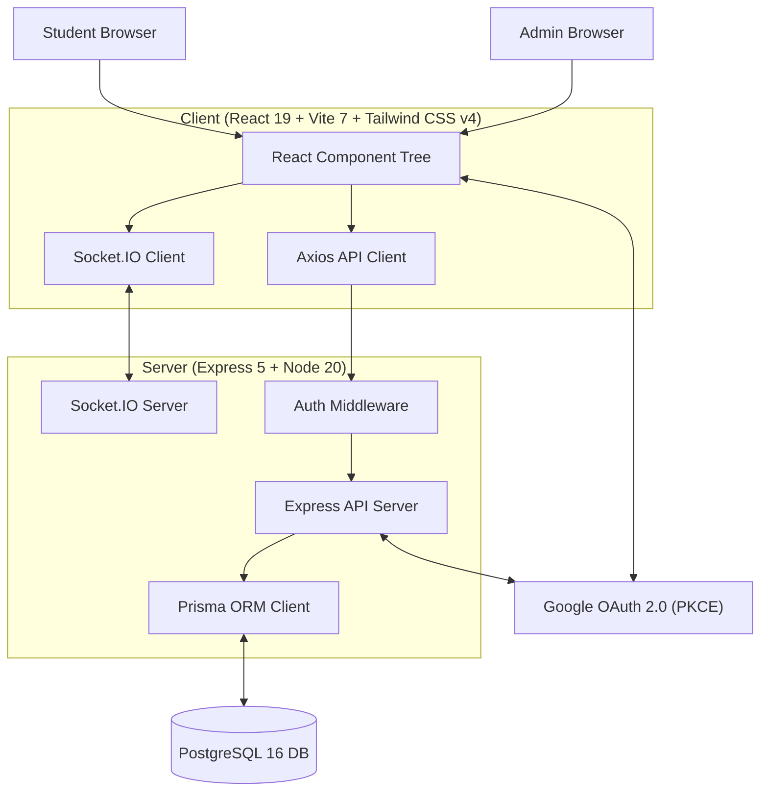
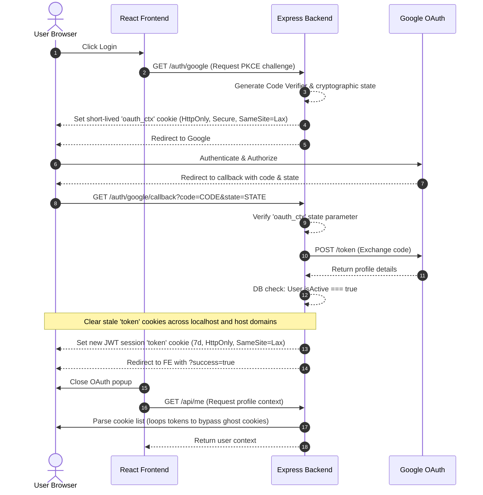
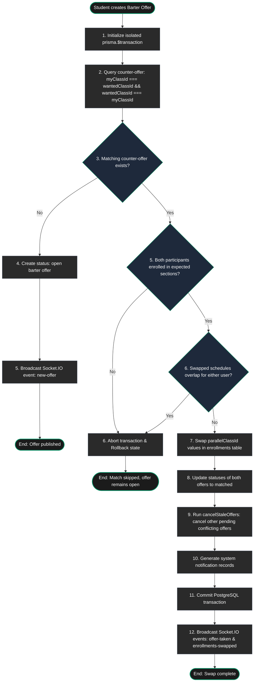

# KRSwitch — System Architecture & Data Flows

This document details the system architecture, authentication lifecycles, and atomic transactional flows for the KRSwitch platform.

---

## 1. System Topology

KRSwitch is a real-time, decoupled client-server application. The diagram below maps the components, network boundaries, and database paths:



---

## 2. Authentication & Session Validation Flow

To prevent session locking due to duplicate browser scopes (e.g., mixing host-only and `localhost` subdomains), the authentication service uses a sequential cookie parsing loop and targeted scope purge:



> [!NOTE]
> **Ghost Cookie Handling**: If duplicate JWT session cookies exist across subdomains, the backend auth middleware iterates through all incoming token values sequentially until a valid signature is found, preventing arbitrary lockouts.

---

## 3. Atomic Barter Matchmaking Engine

Barter matching runs in a PostgreSQL transaction (`prisma.$transaction`) to block race conditions. The logic below determines if a trade is executed immediately or placed in the open ledger:



> [!IMPORTANT]
> **Transactional Isolation**: The matchmaking phase queries and updates student registrations in an atomic database lock block. If schedule overlaps are caught or a counter-offer is concurrently claimed, the transaction rolls back cleanly with no partial modifications saved.

---

## 4. WebSocket Event Topology

Real-time state synchronization is managed via **Socket.IO**:

```
                  ┌────────────────────────┐
                  │    Socket.IO Server    │
                  └───────────┬────────────┘
                              │
             ┌────────────────┴────────────────┐
             ▼                                 ▼
   ┌──────────────────┐               ┌──────────────────┐
   │ Broadcast Room   │               │ Private Rooms    │
   │  (Public Feed)   │               │ ('user-{nim}')   │
   └─────────┬────────┘               └────────┬─────────┘
             │                                 │
   ┌─────────┼─────────┐             ┌─────────┼─────────┐
   ▼         ▼         ▼             ▼         ▼         ▼
online-   new-      offer-        new-      enrollment-  auth-
count     offer     taken         notif     updated      error
```

* **Broadcast Room**: Pushes real-time class feed alterations to all active browsers immediately.
* **Private Rooms**: Handles target-specific messages (e.g., transaction results or administrative schedule changes) strictly to the authenticated student's session.

> [!TIP]
> **WebSocket Security Check**: Unauthenticated socket connections are allowed to connect but placed inside a **10-second authentication window**. If they fail to emit the validated token handshake, the connection is forcefully closed.

---

## 5. Load Simulator Topology

The simulation engine (`simulator.js`) mimics concurrent actions using configured behaviors:

```
[ orchestrator ]
       │
       ├─► 1. Query current valid barter pairs
       ├─► 2. Initialize Telemetry log
       ├─► 3. Spin up concurrent virtual users (Ramp up)
       │
       ▼
 [ User Personas ]
       │
       ├─► Aggressive (15%) ────► Think: 200-1000ms   ──► Action: Accept Offers (85%)
       ├─► Moderate (40%)   ────► Think: 500-2500ms   ──► Action: Accept / Browse (65%)
       ├─► Passive (30%)    ────► Think: 1000-4000ms  ──► Action: Browse / Create (45%)
       └─► Lurkers (15%)    ────► Think: 2000-6000ms  ──► Action: Browse Only (95%)
       │
       ▼
  [ API /take Endpoint ]
       │
       ├─► Staggered concurrent HTTP POST requests within 100ms
       └─► Atomic DB transaction locks row; 1st succeeds, others return 400
       │
       ▼
[ Telemetry Analytics ]
       │
       ├─► Calculate Avg Response Times & Throughput
       └─► Calculate p95 and p99 latency percentiles
```

---

## 👥 Developer Credits

This project is engineered and maintained with ❤️ by:
1. **Gilang Muhamad Widiagung**
2. **Azka Julian**
3. **Muhammad Arifaushan**
