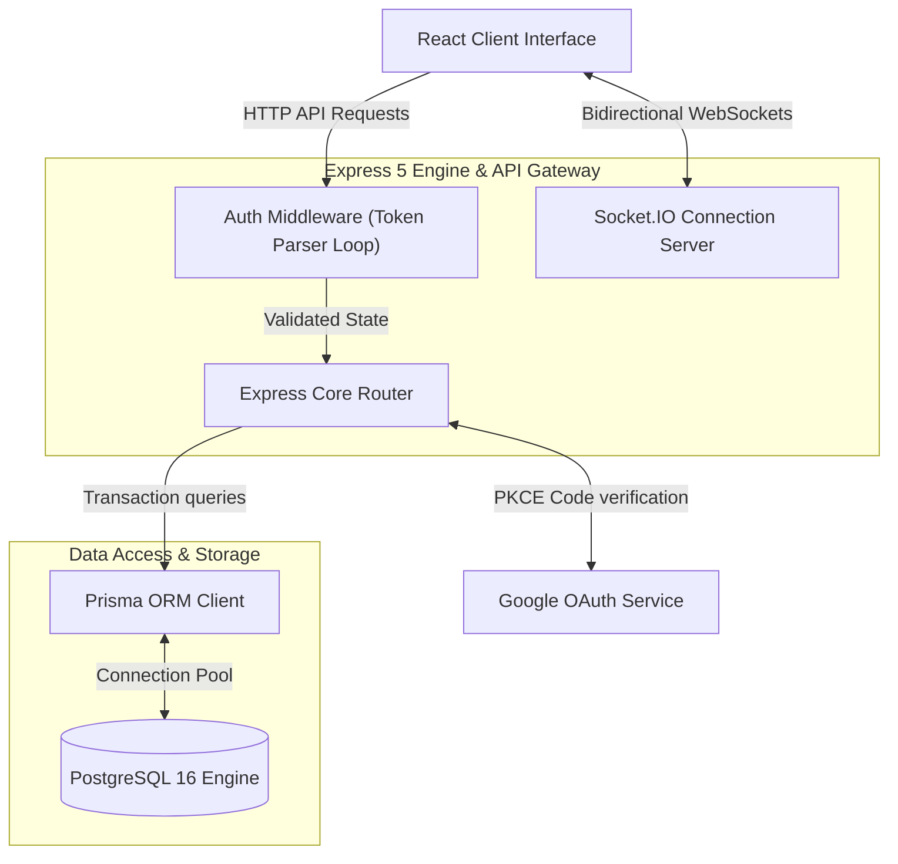
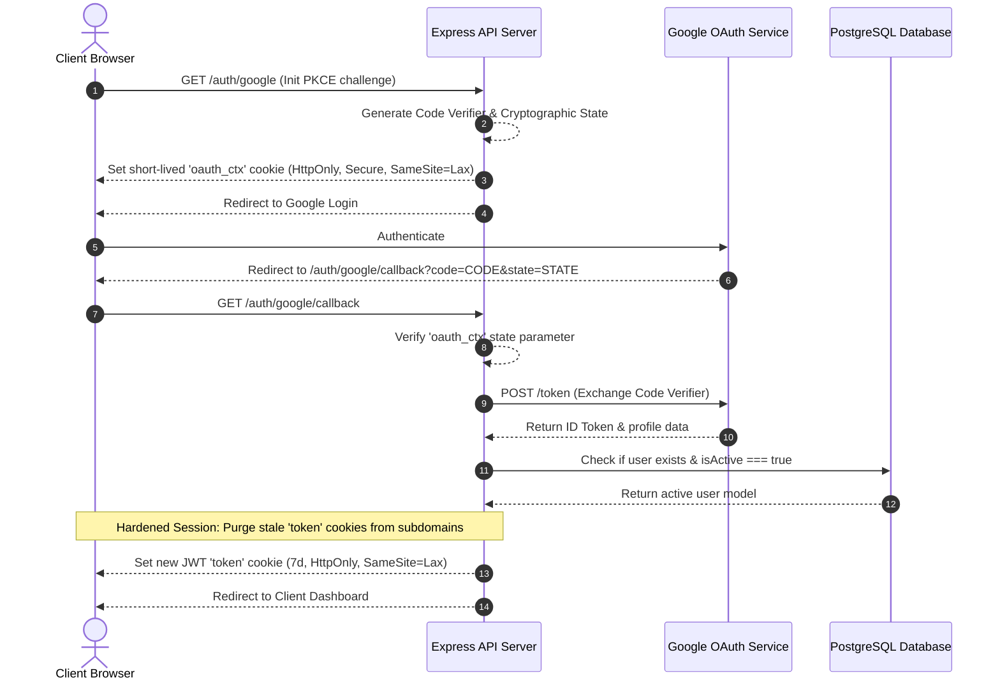
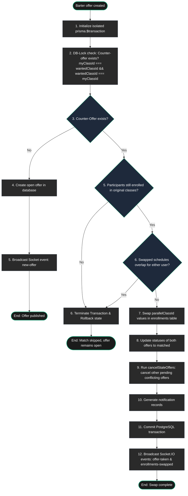

# 📐 KRSwitch Backend — Architectural Flows & Data Blueprints

This blueprint maps the runtime lifecycle, transaction blocks, and data topologies inside the KRSwitch backend engine.

---

## 1. Backend Service Boundaries

The Express API orchestrates route validations, cookie hardening, and WebSocket connectivity. The PostgreSQL database operations run via Prisma ORM:



---

## 2. Google OAuth 2.0 PKCE Verification

The callback service performs the state validation, exchanges authentication codes, loops cookies, and establishes secure SameSite contexts:



> [!NOTE]
> **Sequential Cookie Purge**: To bypass browser zombie session locking across different local subdomains, the Auth Middleware parses the full header token array sequentially and invalidates stale scopes before binding the new active JWT payload.

---

## 3. Atomic Barter Matchmaking Engine

Schedule swaps run strictly within isolated PostgreSQL database locks (`prisma.$transaction`) to prevent concurrency double-claiming:



> [!IMPORTANT]
> **Schedule Overlap Rule**: The interval conflict algorithm evaluates overlapping blocks (`startA < endB && startB < endA`) based on zero-padded standard days and hours. If a conflict is discovered at step 6, the transaction aborts instantly.

---

## 4. WebSocket Event Topology

The Socket.IO server establishes authentication boundaries and broadcasts state updates across channels:

*   **Auth Room Boundary**: Connections must complete token verification inside `10 seconds`. Stale socket keys force disconnections.
*   **System Channels**:
    *   `online-count`: Current active socket footprint.
    *   `new-offer`: Informs clients to append listings to feed pages.
    *   `offer-taken`: Broadcasts trade completions to clean client listings.
    *   `enrollments-swapped`: Broadcasts swapped schedules parameters.

---

## 5. Load Simulator Engine Flow

The simulation orchestrator (`simulator.js`) stresses API layers under behavioral weight loads:

```
[ orchestrator ]
       │
       ├─► 1. Query valid barter targets
       ├─► 2. Initialize Telemetry log
       ├─► 3. Spin up concurrent virtual users (Ramping)
       │
       ▼
 [ User Personas ]
       │
       ├─► Aggressive (15%) ────► Think: 200-1000ms   ──► Action: Accept Offers (85%)
       ├─► Moderate (40%)   ────► Think: 500-2500ms   ──► Action: Accept / Browse (65%)
       ├─► Passive (30%)    ────► Think: 1000-4000ms  ──► Action: Browse / Create (45%)
       └─► Lurkers (15%)    ────► Think: 2000-6000ms  ──► Action: Browse Only (95%)
       │
       ▼
  [ API /take Endpoint ]
       │
       ├─► Staggered concurrent HTTP POST requests within 100ms
       └─► PostgreSQL transactional lock guarantees atomic single winner
```

---

## 👥 Developer Credits

This project is engineered and maintained with ❤️ by:
1. **Gilang Muhamad Widiagung**
2. **Azka Julian**
3. **Muhammad Arifaushan**
