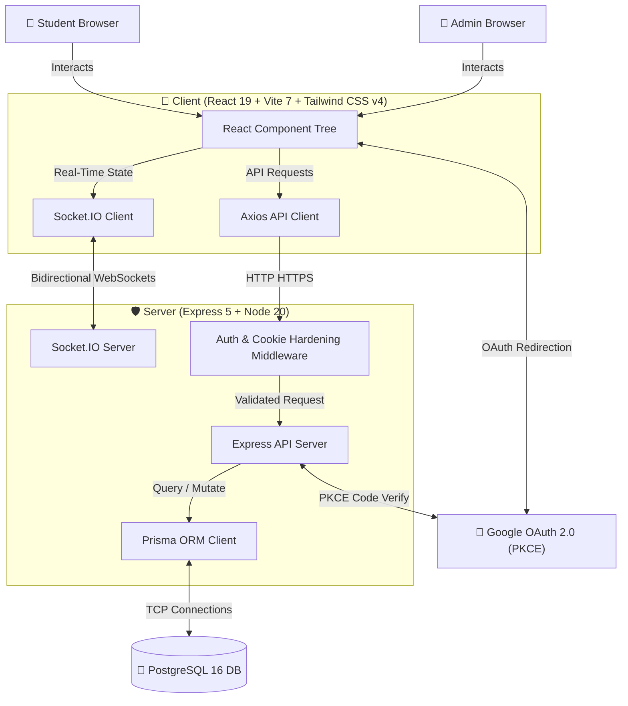
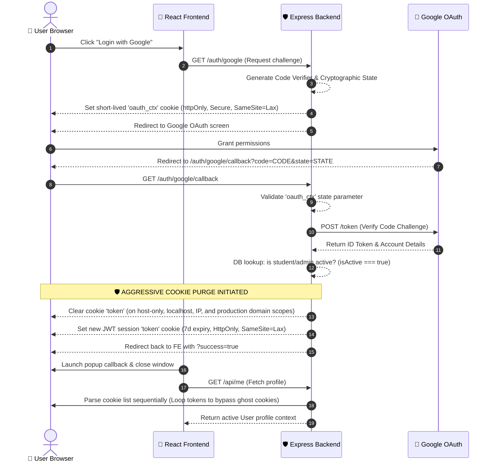

# 📐 KRSwitch — Master System Architecture & Data Flows

Welcome to the central system architecture document for **KRSwitch**. This blueprint outlines how the frontend, backend, database, and real-time WebSocket communication channels interact. It serves as an interactive map for onboarding developers to understand the lifecycle of data, authentication states, and transactional barter operations.

---

## 🌐 1. High-Level System Topology

KRSwitch is built on a decoupled, real-time client-server architecture. The following diagram illustrates how the student/admin browsers, the React 19/Vite 7 frontend, the Express 5 backend server, Socket.IO WebSockets, PostgreSQL, and Google OAuth 2.0 PKCE interact:



---

## 🔑 2. Authentication & Session Hardening Flow

To eliminate persistent "zombie" session lockouts across varying browser contexts, localhost domains, and subdomains, KRSwitch implements a multi-layered session validation and cookie purging routine:



---

## ⚡ 3. Atomic Barter Matchmaking Engine Flow

The barter matchmaking process executes inside an isolated database-level transaction (`prisma.$transaction`). It checks for schedule conflicts, swaps class enrollments, and cascades automatic cancellations of stale/conflicting offers:

```mermaid
flowchart TD
    %% Define styles
    classDef startStop fill:#1b1b1b,stroke:#059669,stroke-width:2px,color:#fff;
    classDef process fill:#2a2a2a,stroke:#374151,stroke-width:1px,color:#fff;
    classDef decision fill:#1e293b,stroke:#047857,stroke-width:1.5px,color:#fff;

    Start([👤 Student submits New Barter Offer]):::startStop
    Start --> InitTx[1. Initialize isolated database transaction 'prisma.$transaction']:::process
    InitTx --> LockDB[2. DB-level Lock: Find matching open counter-offer <br> 'A.myClassId === B.wantedClassId && A.wantedClassId === B.myClassId']:::process
    
    LockDB --> MatchExist{3. Counter-Offer <br> exists? }:::decision
    
    MatchExist -- No --> SaveOpen[4. Save as 'open' offer in barter_offers table]:::process
    SaveOpen --> EmitNew[5. Broadcast Socket event: 'new-offer']:::process
    EmitNew --> SuccessReturn([End: Offer published]):::startStop

    MatchExist -- Yes --> ValidateActive{5. Are both students <br> still enrolled in <br> their respective classes? }:::decision
    
    ValidateActive -- No --> RollbackTx[6. Terminate Transaction & Rollback DB state]:::process
    RollbackTx --> ReturnFail([End: Match skipped, offer remains open]):::startStop

    ValidateActive -- Yes --> ScheduleCheck{6. Calculate conflicts: <br> Does swapped schedule <br> overlap with any existing <br> enrollment for either user? }:::decision

    ScheduleCheck -- Yes (Conflict) --> RollbackTx
    
    ScheduleCheck -- No (Success) --> SwapEnrollments[7. Swap enrollments in database <br> Update 'parallelClassId' for both students]:::process
    SwapEnrollments --> UpdateOfferStatus[8. Update status of both offers to 'matched' <br> Map takers and timestamps]:::process
    UpdateOfferStatus --> CancelStale[9. Execute cancelStaleOffers: <br> Cancel other open offers that are now <br> obsolete (no longer enrolled) <br> or cause schedule conflicts]:::process
    CancelStale --> CreateNotifs[10. Insert dynamic notification records for both users]:::process
    CreateNotifs --> CommitTx[11. Commit transaction atomically to PostgreSQL]:::process
    CommitTx --> EmitSuccess[12. Broadcast WS events: <br> - 'offer-taken' <br> - 'enrollments-swapped' <br> - Send notification packet to private rooms]:::process
    EmitSuccess --> EndSuccess([End: Atomic Barter Complete!]):::startStop
```

---

## 📡 4. Real-Time WebSockets Event Topology

Dynamic sync uses **Socket.IO** to orchestrate events across specialized rooms:

```
                  ┌────────────────────────┐
                  │   Socket.IO Server     │
                  └───────────┬────────────┘
                              │
             ┌────────────────┴────────────────┐
             ▼                                 ▼
   ┌──────────────────┐               ┌──────────────────┐
   │ Broadcast Channel│               │ Private Rooms    │
   │  (To all users)  │               │ ('user-{nim}')   │
   └─────────┬────────┘               └────────┬─────────┘
             │                                 │
   ┌─────────┼─────────┐             ┌─────────┼─────────┐
   ▼         ▼         ▼             ▼         ▼         ▼
online-   new-      offer-        new-      enrollment-  auth-
count     offer     taken         notif     updated      error
```

* **Broadcast Channel**: Emits general marketplace changes. If any user places an offer, completes a trade, or disconnects, the changes reflect instantly across all student screens without page refreshes.
* **Private Rooms**: Restricts sensitive alerts (such as administrative schedule overrides or barter match notifications) strictly to the targeted student's browser context.

---

## 📁 5. High-Load Simulation Flow

When you run `npm run simulate` in the backend repository, the codebase executes the following telemetry pipeline:

```
[ orchestrator.js ]
       │
       ├─► 1. Load Seeding Config & Calculate valid swap paths
       ├─► 2. Initialize Telemetry metrics collectors
       ├─► 3. Spin up concurrent virtual users (Ramping up over 20s)
       │
       ▼
 [ Virtual User Personas ]
       │
       ├─► Aggressive (15%) ────► Think: 200-1000ms   ──► Action: Accept Offers (85%)
       ├─► Moderate (40%)   ────► Think: 500-2500ms   ──► Action: Accept / Browse (65%)
       ├─► Passive (30%)    ────► Think: 1000-4000ms  ──► Action: Browse / Create (45%)
       └─► Lurkers (15%)    ────► Think: 2000-6000ms  ──► Action: Browse Only (95%)
       │
       ▼
  [ API /take Endpoint ]
       │
       ├─► If multiple users claim the same offer inside a 100ms window...
       └─► PostgreSQL handles transactional row locking. Only 1 succeeds, others receive 400.
       │
       ▼
[ Telemetry Report Outputs ]
       │
       ├─► Calculates Avg Response Times & Throughput Rates
       └─► Renders p95 and p99 latency percentiles
```

---

*This architecture is optimized for concurrency, high performance, and robustness. Use this document as a guide when modifying code blocks.*

---

## 👥 Developer Credits

This project is engineered and maintained with ❤️ by:
1. **Gilang Muhamad Widiagung**
2. **Azka Julian**
3. **Muhammad Arifaushan**
