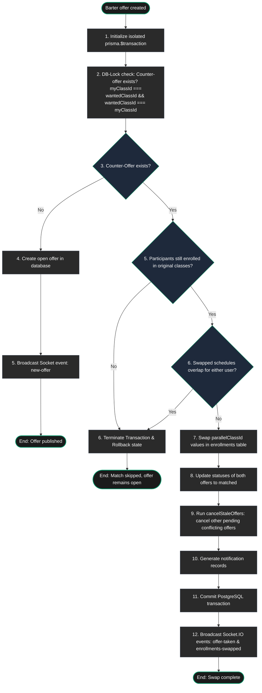

# API Reference

## 1. Atomic Database Operations
Administrative CSV imports (`/import-students`, `/import-classes`) are atomic:
* **Transaction Rollback**: If any record fails schema constraint validation, the transaction rolls back completely to protect integrity.
* **CSV Injection Guard**: Formulas prefixes (`=`, `+`, `-`, `@`) are stripped or escaped during parsing to guard spreadsheet exports against formula injections.

## 2. Two-Way Atomic Matchmaking
The matchmaking logic runs inside a transactional context (`prisma.$transaction`) to prevent concurrency race conditions:
* **Conflict Prevention**: Prior to executing schedule swaps, the engine checks time overlaps (`startA < endB && startB < endA`) based on days and hours formatted in `HH:MM`.
* **Cascade Cancellation**: Upon a successful swap, all other open offers owned by the participants that conflict with their newly assigned schedules, or reference sections they no longer hold, are automatically marked as `cancelled`.
* **Race Condition Blocks**: When multiple HTTP POST requests attempt to `/take` the same offer at the same millisecond, database-level locking ensures only the first request succeeds while subsequent requests return a `400 Bad Request`.

> [!IMPORTANT]
> **Transaction Locks**: Matchmaking queries utilize PostgreSQL row-level locks within the transaction block. This guards critical database states against double-claim swaps when parallel clients select the same barter offer concurrently.

### Matchmaking Engine Diagram

## 3. Exercise: Custom Validation Rules
* **Goal**: Trace API schema validations in `offerController.ts`.
* **Task**:
  1. Locate `createOfferSchema` Zod definition.
  2. Append rules requiring `myClassId` and `wantedClassId` to be positive, non-zero integers.
  3. Append a matching test case in `offerController.test.ts`.
