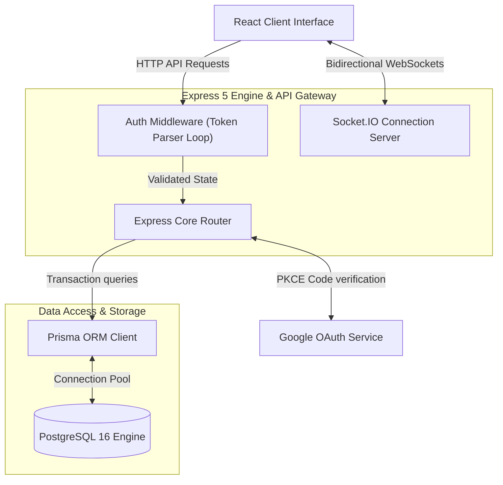
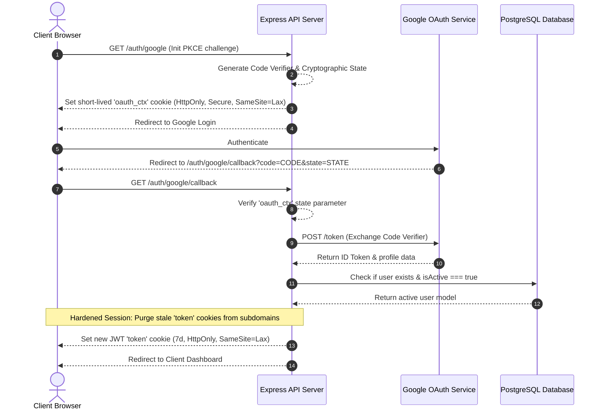

# Architecture

## 1. Backend Service Boundaries

The Express API orchestrates route validations, cookie hardening, and WebSocket connectivity. The PostgreSQL database operations run via Prisma ORM:

## 2. Google OAuth 2.0 PKCE Verification

The callback service performs the state validation, exchanges authentication codes, loops cookies, and establishes secure SameSite contexts:

> [!NOTE]
> **Sequential Cookie Purge**: To bypass browser zombie session locking across different local subdomains, the Auth Middleware parses the full header token array sequentially and invalidates stale scopes before binding the new active JWT payload.

## 3. Session Management & Cookie Hardening
To prevent persistent session issues across localhost and subdomain boundaries, the authentication pipeline uses the following strategies:
* **Domain Purging**: Stale authenticated cookies are proactively cleared from both host-only, localhost subdomains, and configured remote origins during logout and invalid checks.
* **Token Loop**: If the request headers contain duplicate or stale tokens, the verification middleware parses them in sequence until a valid, active session is identified.
* **Status Checks**: Route guards check `isActive === true` inside the database, immediately revoking access from disabled user records regardless of token expiration.

> [!WARNING]
> **Cookie Scopes**: Ensure your `.env` config defines `COOKIE_DOMAIN` strictly to match your execution domain. Mismatched cookie domain configurations can lead to stale JWT parsing errors and session locks in browsers.
