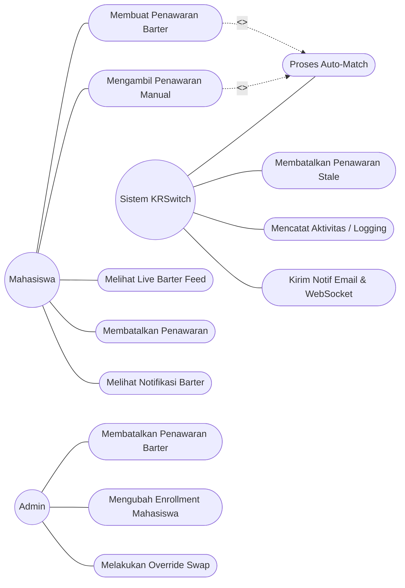
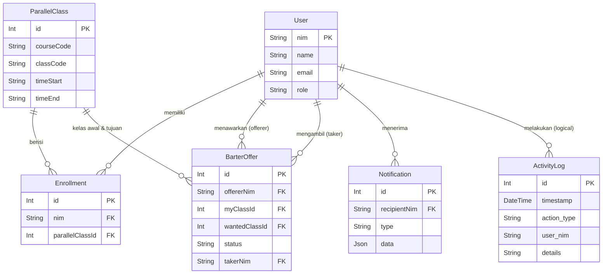
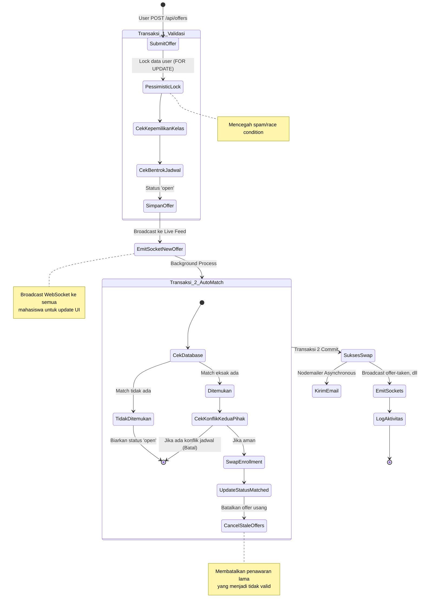
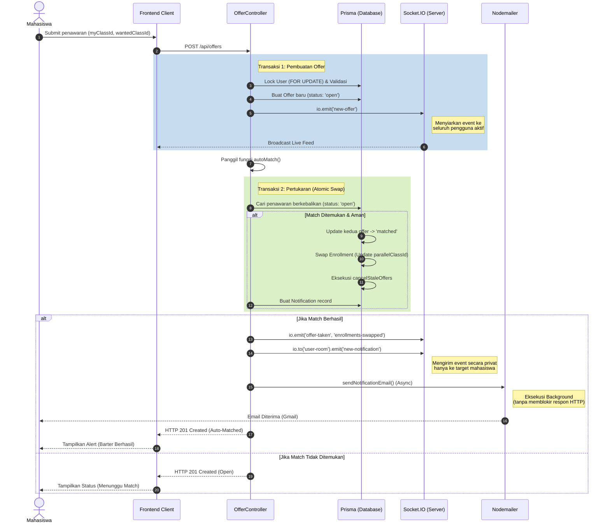

# BAB III HASIL DAN PEMBAHASAN

## 3.1 Requirement Gathering and Analysis

Tahapan *requirement gathering* dilakukan untuk mengidentifikasi dan merumuskan kebutuhan sistem pertukaran jadwal (KRSwitch Barter System). Pengumpulan data difokuskan pada penyelesaian masalah ketidakcocokan jadwal kelas paralel mahasiswa. Sistem harus memfasilitasi pertukaran (*barter*) kelas antara dua pihak yang memiliki kebutuhan saling melengkapi, yang dieksekusi secara otomatis oleh sistem (*Auto-Match*).

### 3.1.1 Use Case Diagram

Berikut adalah Use Case Diagram untuk fitur utama Barter System:



*(Catatan: Use case secara lengkap untuk modul sistem lainnya dapat dilihat pada bagian Lampiran).*

### 3.1.2 Use Case Detail Description: Proses Auto-Match

| Atribut | Deskripsi |
|---|---|
| **Use Case Name** | Proses Auto-Match Barter |
| **Actor** | Sistem KRSwitch |
| **Pre-condition** | Mahasiswa berhasil men-submit penawaran barter baru (kelas yang dimiliki dan kelas yang diinginkan). |
| **Main Flow** | 1. Sistem menerima data penawaran baru.<br>2. Sistem mencari penawaran aktif (*open*) dari mahasiswa lain yang berkebalikan secara eksak.<br>3. Sistem memverifikasi bahwa tidak ada konflik jadwal dari kedua belah pihak jika barter dieksekusi.<br>4. Sistem mengeksekusi pertukaran kelas (*enrollment*) menggunakan *atomic database transaction*.<br>5. Sistem mengubah status kedua penawaran menjadi *matched*.<br>6. Sistem mengirimkan notifikasi kepada kedua belah pihak. |
| **Post-condition** | Jadwal mahasiswa diperbarui, kelas berhasil ditukar, dan status penawaran menjadi ditutup (*matched*). Penawaran lain dari pengguna yang terkait dan menjadi tidak valid (*stale*) dibatalkan secara otomatis. |

## 3.2 Design

### 3.2.1 Entity Relationship Diagram (ERD)

Struktur basis data untuk menopang sistem barter didesain menggunakan skema relasional, di mana entitas utama yang terhubung adalah `User`, `ParallelClass`, `Enrollment`, `BarterOffer`, dan `Notification`.



### 3.2.2 Activity Diagram: Alur Pembuatan Barter & Auto-Match

Activity diagram di bawah mewakili alur logika utama saat penawaran dibuat dan sistem mencoba melakukan proses auto-match di *background*.



### 3.2.3 Sequence Diagram: Auto-Match Barter

Alur sistem komunikasi *client-server* untuk modul barter beserta interaksi *database* diringkas melalui *sequence diagram* berikut:



## 3.3 Implementasi

Pada tahap implementasi, sistem barter dibangun dengan arsitektur modern (React Vite untuk *frontend*, serta Express.js dengan Prisma ORM untuk *backend*). Infrastruktur *deployment* (VPS) menggunakan PM2 untuk menjaga proses *backend*, dan Nginx sebagai *Reverse Proxy* untuk melayani *static files frontend* sekaligus mengarahkan (*proxy pass*) lalu lintas API dan WebSocket. Perhatian utama di level aplikasi ditujukan pada sistem konkurensi, demi mencegah terjadinya *race condition* ketika dua pengguna mencoba melakukan transaksi barter di waktu yang bersamaan.

### 3.3.1 Penjelasan Fitur Auto-Match
Fitur *Auto-Match* adalah *core logic* dari sistem ini. Ketika pengguna menawarkan jadwalnya, fungsi `autoMatch` akan dieksekusi. 
- Logika pertukaran dijalankan di dalam sebuah `prisma.$transaction`. 
- Sistem memverifikasi terlebih dahulu *intersection* jadwal (waktu mulai dan selesai kelas).
- Operasi pengubahan data bersifat *atomik*—seluruh data dieksekusi bersama, jika gagal satu maka sistem membatalkan semuanya (*rollback*).

**Pembagian Tanggung Jawab:**
- Bagian ini difokuskan pada pengembangan logika *Backend* (`OfferController`), meliputi: *conditional logic update*, pembatalan otomatis untuk *stale offers* (penawaran yang kedaluwarsa setelah jadwal berubah), serta pembuatan notifikasi terpusat terkait berhasil-gagalnya transaksi.

### 3.3.2 Potongan Kode Logika Auto-Match (Backend)

Berikut adalah potongan kode inti pada `offerController.ts` yang menangani *atomic conditional update* untuk mengamankan data dari kompetisi akses bersamaan (*race condition*).

```typescript
// Implementasi: Atomic conditional status update pada offerController.ts
// Untuk mengamankan offer agar tidak diklaim ganda oleh user lain dalam hitungan milidetik
const [matchingOfferUpdate, offerUpdate] = await Promise.all([
  tx.barterOffer.updateMany({
    where: { id: matchingOffer.id, status: 'open' },
    data: { status: 'matched', takerNim: offer.offererNim, completedAt: now }
  }),
  tx.barterOffer.updateMany({
    where: { id: offer.id, status: 'open' },
    data: { status: 'matched', takerNim: matchingOffer.offererNim, completedAt: now }
  })
]);

if (matchingOfferUpdate.count === 0 || offerUpdate.count === 0) {
  throw new Error('Concurrent auto-match collision: offer already claimed');
}

// Eksekusi pertukaran jadwal mahasiswa (Swap Enrollment)
await Promise.all([
  tx.enrollment.updateMany({ 
    where: { nim: matchingOffer.offererNim, parallelClassId: matchingOffer.myClassId }, 
    data: { parallelClassId: matchingOffer.wantedClassId } 
  }),
  tx.enrollment.updateMany({ 
    where: { nim: offer.offererNim, parallelClassId: offer.myClassId }, 
    data: { parallelClassId: offer.wantedClassId } 
  }),
]);
```

### 3.3.3 Screenshot Implementasi

*(Silakan ganti/tambahkan screenshot aplikasi aslinya di bawah ini).*


> **Gambar 3.1:** Antarmuka *Live Barter Feed* di mana mahasiswa melihat penawaran aktif.


> **Gambar 3.2:** *Modal* untuk membuat penawaran baru dan integrasi tampilan notifikasi.


## 3.4 Integration & Testing

### 3.4.1 Proses Integrasi
Integrasi sistem KRSwitch bertumpu pada tiga pilar komunikasi utama:
1. **RESTful API**: Digunakan untuk operasi standar klien (CRUD penawaran).
2. **WebSocket (melalui Socket.IO)**: Digunakan untuk komunikasi asinkron *real-time*. *Live Barter Feed* & *Modal Notification* menerima *push events* dari *server* segera setelah *Auto-Match* berhasil, memperbarui *state* antarmuka tanpa perlu me-*refresh* halaman. Jalur ini diamankan dengan *multi-device limit* dan ditunjang oleh konfigurasi *Connection Upgrade* pada Nginx.
3. **Email Notification (Nodemailer)**: Layanan latar belakang yang mengirimkan pesan rekap mutasi jadwal secara otomatis ke email mahasiswa apabila barter mereka berhasil ter-*match* atau ketika terdapat intervensi pembatalan dari Administrator.

### 3.4.2 Hasil Pengujian (Testing)
Pengujian fungsional modul sistem barter dilakukan menggunakan dua pendekatan:
1. **API / Backend Testing:** Pengujian logika *intersection* jadwal (fungsi `hasScheduleConflict`) dan memvalidasi kebenaran proses *database transaction rollback*.
2. **End-to-End (E2E) Testing (menggunakan Cypress):** Skenario pembuatan, pertukaran, dan pembatalan penawaran dijalankan otomatis dari sisi *browser* untuk mencegah masalah inkonsistensi (*stale data*) antara komponen antarmuka yang ada dengan respon sistem.

- **Alamat URL (*Staging/Production*):** `[ISI DENGAN URL DEPLOYMENT JIKA ADA, MISAL: https://krswitch.app]`
- **Hasil Pengujian:** Seluruh *test case* untuk alur fungsional barter auto-match dikonfirmasi **PASSED**. Sistem terbukti andal dalam menyelesaikan logika konkurensi *(race condition)* tanpa merusak integritas *database*, dan notifikasi asinkron berjalan sesuai logika pembatalan *stale offer*.
