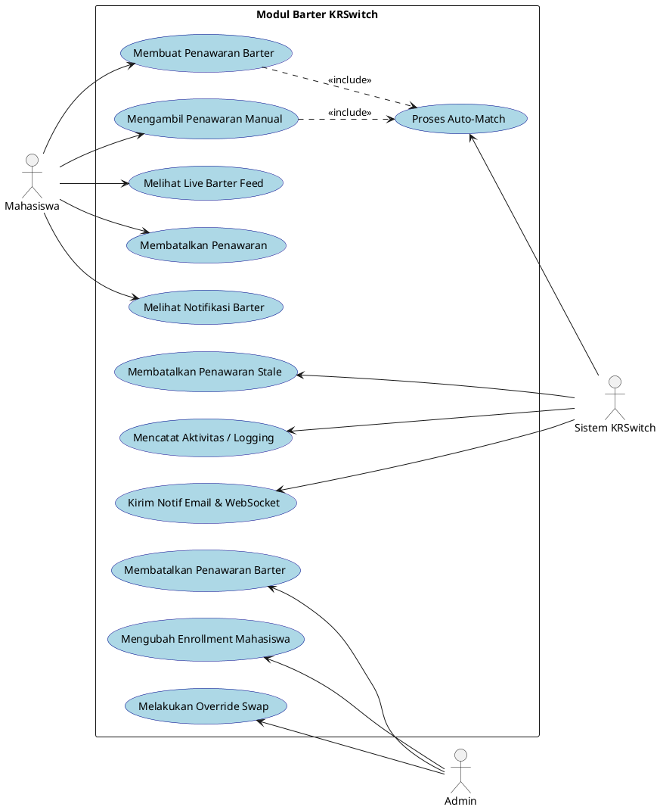
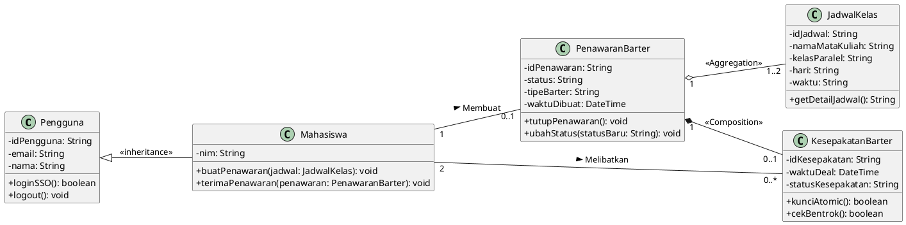
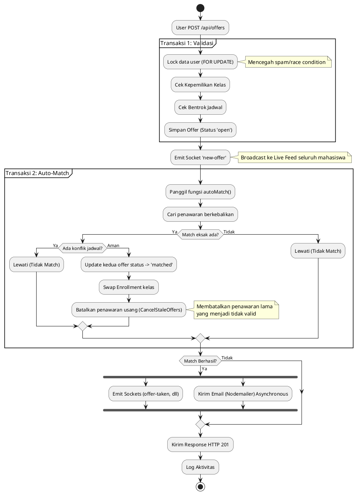
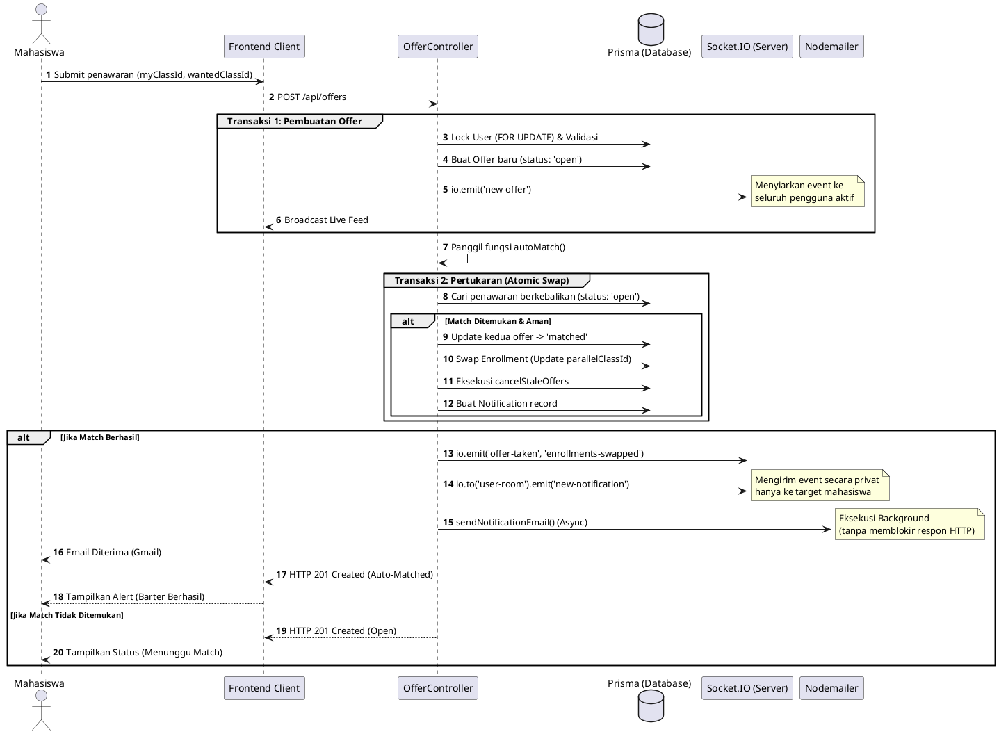

# BAB III HASIL DAN PEMBAHASAN

## 3.1 Requirement Gathering and Analysis

Tahapan *requirement gathering* dilakukan untuk mengidentifikasi dan merumuskan kebutuhan sistem pertukaran jadwal (KRSwitch Barter System). Kegiatan pengumpulan kebutuhan ini dilaksanakan melalui serangkaian diskusi kelompok, penyusunan *Software System Requirements (SSR)*, serta perumusan *Term of Reference (TOR)* di fase awal pengembangan. Pengumpulan data difokuskan pada penyelesaian masalah ketidakcocokan jadwal kelas paralel mahasiswa. Sistem harus memfasilitasi pertukaran (*barter*) kelas antara dua pihak yang memiliki kebutuhan saling melengkapi, yang dieksekusi secara otomatis oleh sistem (*Auto-Match*). Dokumen lengkap SSR dan TOR dilampirkan pada bagian lampiran laporan ini.

### 3.1.1 Use Case Diagram

Berikut adalah Use Case Diagram untuk fitur utama Barter System:



*(Catatan: Use case secara lengkap untuk modul sistem lainnya dapat dilihat pada bagian Lampiran).*

### 3.1.2 Use Case Detail Description: Proses Auto-Match

| Atribut | Deskripsi |
|---|---|
| **Use Case Name** | Proses Auto-Match Barter |
| **Actor** | Sistem KRSwitch |
| **Pre-condition** | Mahasiswa berhasil men-submit penawaran barter baru (kelas yang dimiliki dan kelas yang diinginkan). |
| **Main Flow** | 1. Sistem menerima data penawaran baru.<br>2. Sistem mencari penawaran aktif (*open*) dari mahasiswa lain yang berkebalikan secara eksak.<br>3. Sistem memverifikasi bahwa tidak ada konflik jadwal dari kedua belah pihak jika barter dieksekusi.<br>4. Sistem mengeksekusi pertukaran kelas (*enrollment*) menggunakan *atomic database transaction*.<br>5. Sistem mengubah status kedua penawaran menjadi *matched*.<br>6. Sistem mengirimkan notifikasi kepada kedua belah pihak. |
| **Post-condition** | Jadwal mahasiswa diperbarui, kelas berhasil ditukar, dan status penawaran menjadi ditutup (*matched*). Penawaran lain dari pengguna yang terkait dan menjadi tidak valid (*stale*) dibatalkan secara otomatis. |

## 3.2 Design

### 3.2.1 Class Diagram (ERD)

Arsitektur logis untuk menopang sistem barter didesain menggunakan skema berorientasi objek (*Class Diagram*), di mana entitas konseptual utama yang saling berinteraksi adalah `Pengguna`, `Mahasiswa`, `JadwalKelas`, `PenawaranBarter`, dan `KesepakatanBarter`.



**Fungsi Tiap Kelas:**
1. **Pengguna**: Kelas induk yang menampung data dasar autentikasi (Google SSO) untuk siapa saja yang masuk ke sistem KRSwitch.
2. **Mahasiswa**: Kelas turunan dari `Pengguna` yang bertindak sebagai aktor utama yang melakukan aksi barter. Memiliki operasi `buatPenawaran()` untuk mendaftarkan kelasnya dan `terimaPenawaran()` untuk mengkonfirmasi pertukaran secara manual.
3. **PenawaranBarter**: Kelas inti yang merepresentasikan satu *record* penawaran barter yang dibuat oleh mahasiswa. Atribut `tipeBarter` membedakan antara barter publik dan privat. Metode `ubahStatus()` digunakan oleh sistem untuk transisi status ('open' → 'matched' / 'cancelled').
4. **JadwalKelas**: Merepresentasikan satu kelas paralel (mata kuliah, kode kelas, hari, dan waktu) yang menjadi subjek pertukaran. Satu `PenawaranBarter` mengandung dua referensi `JadwalKelas` (kelas yang dimiliki dan kelas yang diinginkan).
5. **KesepakatanBarter**: Kelas yang diinstansiasi ketika *Auto-Match* berhasil. Memiliki metode `kunciAtomic()` untuk merepresentasikan logika *atomic transaction* (mengunci penawaran agar tidak diklaim ganda) dan `cekBentrok()` untuk memvalidasi konflik jadwal.

### 3.2.2 Activity Diagram: Alur Pembuatan Barter & Auto-Match


Activity diagram di bawah mewakili alur logika utama saat penawaran dibuat dan sistem mencoba melakukan proses auto-match di *background*.



### 3.2.3 Sequence Diagram: Auto-Match Barter

Alur sistem komunikasi *client-server* untuk modul barter beserta interaksi *database* diringkas melalui *sequence diagram* berikut:



### 3.2.4 Desain Antarmuka (Lo-Fi & Hi-Fi)

Untuk menjembatani alur logika sistem dengan pengalaman pengguna, dilakukan perancangan antarmuka awal berupa *Wireframe* (*Lo-Fi*) untuk memvalidasi tata letak komponen. Rancangan tersebut kemudian disempurnakan menjadi purwarupa interaktif (*Hi-Fi Prototype*) bernuansa modern menggunakan Figma.


> **Gambar 3.X** Rancangan *Wireframe* (Lo-Fi) untuk *Live Feed* dan Form Barter.


> **Gambar 3.Y** Desain Antarmuka Akhir (Hi-Fi) yang diimplementasikan pada aplikasi.

## 3.3 Implementasi

Pada tahap implementasi, sistem barter dibangun menggunakan arsitektur modern (React Vite untuk *frontend*, serta Express.js dengan Prisma ORM untuk *backend*). Proses implementasi berfokus pada keandalan sistem konkurensi (mencegah *race condition*). Berikut adalah penjelasan kegiatan tahapan implementasi fitur-fitur utama pada modul barter:

### 3.3.1 Fitur Pembuatan Penawaran Barter
Fitur ini memungkinkan mahasiswa untuk mendaftarkan jadwal kelas paralel yang ingin ditukar. Sistem mewajibkan validasi ketat, seperti pengecekan kepemilikan kelas dan validasi konflik jadwal, sebelum penawaran dipublikasikan ke publik.
- **Tanggung Jawab**: *Backend Developer* (API Logika) dan *Frontend Developer* (Antarmuka Form).


> **Gambar 3.1** Tampilan modal pembuatan penawaran barter oleh Mahasiswa.

Pada *backend*, proses ini diimplementasikan menggunakan *Pessimistic Locking* pada *database transaction* untuk mencegah mahasiswa melakukan *spam* tombol secara bersamaan (*race condition*).

```typescript
// Kode: routes/offers.ts - Transaksi pembuatan offer
const txResult = await prisma.$transaction(async (tx) => {
  // Pessimistic lock: serialize concurrent actions from the same student
  await tx.$queryRaw`SELECT nim FROM users WHERE nim = ${offererNim} FOR UPDATE`;

  // Validasi: mahasiswa harus terdaftar di kelas tersebut
  const enrollment = await tx.enrollment.findFirst({
    where: { nim: offererNim, parallelClassId: myClassId }
  });
  if (!enrollment) throw new Error('You are not enrolled in this class');

  // Validasi: cegah duplikat penawaran
  const duplicateOffer = await tx.barterOffer.findFirst({
    where: { offererNim, myClassId, status: 'open' }
  });
  if (duplicateOffer) throw new Error('You already have an open offer for this class');

  // Validasi: cek konflik jadwal dengan kelas yang diinginkan
  const offererOtherEnrollments = await getUserEnrollmentsExcluding(offererNim, myClassId, tx);
  const conflictingClass = offererOtherEnrollments.find(e =>
    hasScheduleConflict(e.parallelClass, wantedClass)
  );
  if (conflictingClass) throw new Error(`Jadwal bentrok: ...`);

  // Simpan penawaran baru
  return await tx.barterOffer.create({
    data: { offererNim, myClassId, wantedClassId, status: 'open' },
  });
});
```
> **Gambar 3.2** Potongan kode controller untuk validasi pembuatan penawaran.

Potongan kode di atas (Gambar 3.2) menunjukkan fungsi `POST /api/offers`. Pertama dilakukan penguncian *row user* (`FOR UPDATE`) agar permintaan yang sama dari pengguna yang sama diproses secara serial. Setelah validasi kepemilikan kelas dan konflik jadwal lolos, penawaran disimpan dengan status 'open'.

### 3.3.2 Fitur Auto-Match & Atomic Swap
Fitur *Auto-Match* adalah *core logic* otomatis dari sistem barter. Ketika ada penawaran baru yang disimpan, sistem akan mencari penawaran aktif (*open*) dari mahasiswa lain yang berkebalikan secara eksak, lalu menukar kelas mereka secara atomik.
- **Tanggung Jawab**: *Backend Developer* (Prisma ORM & *Conditional Logic*).


> **Gambar 3.3** Tampilan notifikasi berhasilnya pertukaran jadwal (Auto-Match).

Proses ini sangat rentan terhadap kegagalan transaksi ganda apabila dua mahasiswa berupaya mengambil penawaran yang sama di detik yang sama. Oleh karena itu, diimplementasikan pertukaran *atomic*.

```typescript
// Kode: controllers/offerController.ts - Atomic conditional update
// Menggunakan conditional WHERE agar hanya berhasil jika status masih 'open'
const [matchingOfferUpdate, offerUpdate] = await Promise.all([
  tx.barterOffer.updateMany({
    where: { id: matchingOffer.id, status: 'open' },
    data: { status: 'matched', takerNim: offer.offererNim, completedAt: now }
  }),
  tx.barterOffer.updateMany({
    where: { id: offer.id, status: 'open' },
    data: { status: 'matched', takerNim: matchingOffer.offererNim, completedAt: now }
  })
]);

// Jika count = 0 berarti offer sudah diklaim pihak lain (race condition)
if (matchingOfferUpdate.count === 0 || offerUpdate.count === 0) {
  throw new Error('Concurrent auto-match collision: offer already claimed');
}

// Eksekusi swap jadwal kedua mahasiswa secara bersamaan
await Promise.all([
  tx.enrollment.updateMany({
    where: { nim: matchingOffer.offererNim, parallelClassId: matchingOffer.myClassId },
    data: { parallelClassId: matchingOffer.wantedClassId }
  }),
  tx.enrollment.updateMany({
    where: { nim: offer.offererNim, parallelClassId: offer.myClassId },
    data: { parallelClassId: offer.wantedClassId }
  }),
]);
```
> **Gambar 3.4** Potongan kode implementasi logika Auto-Match (Backend).

Berdasarkan Gambar 3.4, logika pertukaran dieksekusi di dalam `prisma.$transaction`. Sistem meng-*update* penawaran menggunakan *conditional state* (`where: { status: 'open' }`). Jika penawaran sudah diklaim lebih dulu oleh pengguna lain, maka `count` akan bernilai `0` dan seluruh transaksi dibatalkan otomatis (*rollback*), sehingga mencegah duplikasi kepemilikan kelas.

### 3.3.3 Fitur Notifikasi Asinkron (Socket.IO & Email)
Fitur notifikasi ini bertugas memberitahukan hasil eksekusi barter secara instan ke layar pengguna (*real-time*) dan memberikan rekam mutasi jadwal yang sah ke email mahasiswa yang bersangkutan.
- **Tanggung Jawab**: *Backend Developer* (Socket Server & Nodemailer) dan *Frontend Developer* (Socket Listener).


> **Gambar 3.5** Tampilan inbox email mahasiswa yang menerima notifikasi mutasi.

Proses pengiriman pesan (WebSockets) dan pengiriman Email dilakukan di latar belakang (*asynchronous*).

```typescript
// Kode: routes/offers.ts - Broadcast Socket & Kirim Email (dipanggil setelah Transaksi 2 commit)

// Broadcast ke SELURUH pengguna aktif: perbarui Live Feed
io.emit('offer-taken', { offerId: matchingOffer.id });
io.emit('offer-taken', { offerId: offer.id });
io.emit('enrollments-swapped', { swaps });

// Kirim notifikasi privat hanya ke user yang terlibat
io.to(`user-${matchingOffer.offererNim}`).emit('new-notification', offererNotification);
io.to(`user-${offer.offererNim}`).emit('new-notification', takerNotification);

// Kirim email secara asynchronous (tidak memblokir respon HTTP)
sendNotificationEmail(
  matchingOffer.offererNim,
  offererNotification.type,
  offererNotification.data
).catch(console.error);

sendNotificationEmail(
  offer.offererNim,
  takerNotification.type,
  takerNotification.data
).catch(console.error);
```
> **Gambar 3.6** Potongan kode pengiriman pesan Socket.IO dan Nodemailer.

Berdasarkan Gambar 3.6, `io.emit()` menyiarkan pembaruan data ke *Live Feed* seluruh pengguna, sedangkan `io.to('user-room').emit()` mengirim notifikasi privat hanya ke kedua mahasiswa yang terlibat. Fungsi `sendNotificationEmail()` dipanggil dengan `.catch()` tanpa `await`, artinya proses pengiriman surel berjalan di latar belakang tanpa menahan respon API yang sudah dikirimkan ke pengguna.
### 3.3.4 Fitur Administrator (Manajemen Sistem & Intervensi)

Sistem KRSwitch dilengkapi dengan dasbor Administrator yang berfungsi sebagai lapisan kontrol utama (*core system*) untuk mengelola anomali dan keluhan mahasiswa. Admin memiliki hak istimewa untuk melakukan intervensi langsung terhadap siklus hidup pertukaran kelas.
- **Tanggung Jawab**: *Backend Developer* (Admin API & Atomic Transaction) dan *Frontend Developer* (Admin Dashboard UI).


> **Gambar 3.7** Tampilan dasbor Administrator untuk melakukan Override Swap dan Manajemen Barter.

Dua fungsi intervensi paling kritikal yang dimiliki Administrator adalah:
1. **Force Cancel Offer**: Admin dapat membatalkan penawaran (*offer*) aktif milik mahasiswa kapan saja (misal: karena melanggar aturan). Sistem akan secara otomatis menyiarkan (*broadcast*) notifikasi pembatalan ini ke klien melalui WebSocket.
2. **Override Swap (Pertukaran Paksa)**: Admin dapat secara sepihak memutarbalikkan kelas (*enrollment*) antara dua mahasiswa tanpa memerlukan penawaran *barter* yang cocok dari mahasiswa bersangkutan. Fitur ini menggunakan *Atomic Transaction* untuk memastikan data kelas terganti secara absolut dan membatalkan semua penawaran usang yang terkait dengan kelas tersebut.
3. **Manajemen Master Data (Import & Export CSV)**: Admin memiliki kemampuan untuk melakukan inisialisasi basis data secara masif melalui fitur *upload* berkas `.csv` (Data Mahasiswa dan Data Jadwal Kelas), yang divalidasi dan diproses secara efisien menggunakan pustaka `csv-parser`. Admin juga dapat mengekspor rekap jadwal terkini untuk sinkronisasi dengan sistem akademik (SIAK).


> **Gambar 3.7b** Tampilan antarmuka *Dashboard* Admin untuk fitur *Import/Export* Data Master CSV.
4. **Data Randomization (Simulasi Bentrok Massal)**: Terdapat fungsi khusus `randomizeEnrollments()` yang berfungsi untuk mengacak secara massal pendaftaran kelas (KRS) seluruh mahasiswa. Fitur ini sangat krusial sebagai alat simulasi (*stress-testing*) untuk menguji ketangguhan algoritma *Auto-Match* di kondisi ekstrim tanpa harus bergantung pada skrip *dev seeding* manual.
5. **Dashboard Manajemen Mahasiswa Terpadu**: Antarmuka (*frontend*) Administrator menyediakan panel kontrol terpusat untuk memantau aktivitas tiap entitas mahasiswa yang terbagi ke dalam empat sub-modul (tab) interaktif:
   - **Tab KRS**: Modul untuk memantau seluruh kelas paralel (*enrollments*) yang sedang diambil mahasiswa.
   - **Tab Barter**: Modul untuk memantau riwayat dan status penawaran barter milik mahasiswa.
   - **Tab Override**: Antarmuka pengeksekusi fungsi *Force Swap* (seperti yang telah dijelaskan di poin 2).
   - **Tab Akun**: Modul administratif untuk memantau informasi profil profil pengguna.


> **Gambar 3.7c** Tampilan antarmuka *Dashboard* Admin untuk Panel Manajemen Mahasiswa (KRS, Barter, Override, Akun).

```typescript
// Kode: routes/admin/override.ts - Transaksi Pertukaran Paksa (Override Swap)
const [updated1, updated2] = await prisma.$transaction([
  prisma.enrollment.update({
    where: { id: enroll1.id },
    data: { parallelClassId: enroll2.parallelClassId },
  }),
  prisma.enrollment.update({
    where: { id: enroll2.id },
    data: { parallelClassId: enroll1.parallelClassId },
  }),
]);

// Membatalkan penawaran aktif (stale) yang menjadi tidak relevan akibat override
await prisma.barterOffer.updateMany({
  where: { id: { in: staleOffers.map(o => o.id) } },
  data: { status: 'cancelled' },
});

// Mencatat aktivitas kritis admin ke dalam Audit Log
await logActivity(
  'ADMIN_OVERRIDE_SWAP', 
  req.user.nim, 
  `FORCED SWAP: ${u1.name} <-> ${u2.name} for course ${courseCode}.`
);
```
> **Gambar 3.8** Potongan kode eksekusi *Override Swap* dan *Audit Logging* oleh Administrator.

Berdasarkan Gambar 3.8, aksi mutasi paksa ini dilindungi oleh blok `prisma.$transaction`. Selain memanipulasi kepemilikan kelas, sistem juga wajib memanggil fungsi `logActivity()` untuk menyimpan *Audit Trail*, memastikan setiap intervensi manual oleh Admin terekam secara persisten untuk transparansi.

## 3.4 Integration & Testing

### 3.4.1 Proses Integrasi

Integrasi sistem KRSwitch dirancang dengan pola *Client-Server* modern yang menghubungkan tiga lapisan arsitektur utama:
1. **Frontend ke Backend (React Vite → Express.js)**: Integrasi antarmuka klien dengan *server* dilakukan menggunakan dua jalur komunikasi utama. Jalur pertama adalah **RESTful API** berbasis HTTP untuk operasi pengiriman form penawaran secara sinkron. Jalur kedua adalah **WebSocket (Socket.IO)** yang membuka koneksi *two-way* agar *frontend* bisa menerima kejadian (*event*) secara *real-time* (seperti pembaruan *Live Feed* setelah *Auto-Match* terjadi) tanpa perlu memuat ulang (*refresh*) halaman.
2. **Backend ke Database (Express.js → PostgreSQL)**: Sistem *backend* berintegrasi dengan basis data relasional PostgreSQL melalui **Prisma ORM**. Integrasi di lapisan ini sangat krusial karena memanfaatkan mekanisme penguncian pesimistis (*Pessimistic Locking*) dan *Atomic Transactions* (`prisma.$transaction`) untuk memastikan tidak terjadi duplikasi kepemilikan kelas jika ada permintaan barter yang masuk bersamaan di satu waktu.
3. **Backend ke External Services (Nodemailer)**: Terakhir, sistem *backend* diintegrasikan dengan *server* SMTP menggunakan Nodemailer untuk menjalankan *background job* pengiriman notifikasi email secara asinkron tanpa mengganggu performa *response time* dari API utama.

### 3.4.2 Hasil Pengujian (Testing)
Pengujian fungsional modul sistem barter dilakukan menggunakan dua pendekatan:
1. **API / Backend Testing:** Pengujian logika *intersection* jadwal (fungsi `hasScheduleConflict`) dan memvalidasi kebenaran proses *database transaction rollback*.
2. **End-to-End (E2E) Testing (menggunakan Cypress):** Skenario pembuatan, pertukaran, dan pembatalan penawaran dijalankan otomatis dari sisi *browser* untuk mencegah masalah inkonsistensi (*stale data*) antara komponen antarmuka yang ada dengan respon sistem.

- **Alamat URL (*Staging/Production*):** `[ISI DENGAN URL DEPLOYMENT JIKA ADA, MISAL: https://krswitch.app]`
- **Hasil Pengujian:** Seluruh *test case* untuk alur fungsional barter auto-match dikonfirmasi **PASSED**. Sistem terbukti andal dalam menyelesaikan logika konkurensi *(race condition)* tanpa merusak integritas *database*, dan notifikasi asinkron berjalan sesuai logika pembatalan *stale offer*.


